# Diagrama de Clases — CityPulse

## 1. Diagrama de Clases

```mermaid
classDiagram
    direction TB

    class Vehiculo {
        +String id
        +float velocidad_max
        +float aceleracion
        +float frenado
        +float velocidad_actual
        +float progreso
        +float offset_lateral
        +float angulo_visual
        +float tiempo_espera
        +float agresividad
        +float tiempo_reaccion
        +float tolerancia_amarillo
        +String _estado_cambio
        +bool ES_PRIORITARIO
        +Carril carril
        +actualizar(dt, vehiculo_frente, estado_semaforo)
        +intentar_cambio_carril(vehiculo_frente)
        +posicion_px() tuple
        +frente_progreso() float
        +cola_progreso() float
        +salio_del_mapa() bool
        +ya_cruzo_linea_de_pare() bool
        +_conviene_cambiar(carril_destino, vehiculo_frente) bool
        +_hueco_seguro_en(carril_destino) bool
        +_ejecutar_cambio_si_listo(dt)
        +_actualizar_animacion_lateral(dt)
        +_abortar_cambio(cooldown)
    }

    class VehiculoPrioritario {
        +bool ES_PRIORITARIO
        +float VELOCIDAD_MAX
        +float ACELERACION
        +float FACTOR_VEL_LATERAL
        +_conviene_cambiar(carril_destino, vehiculo_frente) bool
    }

    class Automovil {
        +float VELOCIDAD_MAX
        +float ACELERACION
        +int ANCHO
        +int ALTO
        +float ANGULO_MAX_VISUAL
        +float FACTOR_VEL_LATERAL
    }

    class Moto {
        +float VELOCIDAD_MAX
        +int ancho_logico
        +float ANGULO_MAX_VISUAL
        +float FACTOR_VEL_LATERAL
        +_hueco_seguro_en(carril_destino) bool
    }

    class Bus {
        +float VELOCIDAD_MAX
        +float FACTOR_VEL_LATERAL
        +float ANGULO_MAX_VISUAL
    }

    class Camion {
        +float VELOCIDAD_MAX
        +float FACTOR_VEL_LATERAL
        +float ANGULO_MAX_VISUAL
    }

    class Ambulancia {
        +String COLOR_RESPALDO
        +List SPRITES
    }

    class Policia {
        +String COLOR_RESPALDO
        +List SPRITES
    }

    class Carril {
        +String id_carril
        +String eje
        +float coordenada_fija
        +int direccion
        +float inicio
        +float fin
        +float spawn_intervalo
        +float temporizador_spawn
        +List vehiculos
        +List vecinos
        +List progreso_pares
        +dict mezcla_vehiculos
        +float longitud_total
        +nivel_congestion() float
        +posicion_mundo(progreso) tuple
    }

    class Via {
        +int x
        +int y
        +int ancho
        +int alto
        +String orientacion
        +bool linea_central
        +List lineas_separacion
    }

    class Semaforo {
        +String id
        +int x
        +int y
        +String grupo
        +String lado
    }

    class Controlador {
        +float verde_h
        +float amarillo_h
        +float verde_v
        +float amarillo_v
        +float _t
        +String _fase
        +actualizar(dt)
        +estado_grupo(grupo) String
        +tiempo_restante_grupo(grupo) float
    }

    class Escenario {
        +String nombre
        +int ancho
        +int alto
        +List vias
        +List carriles
        +List semaforos
        +List cebras
        +List lineas_pare
        +Controlador controlador
        +actualizar(dt)
        +reiniciar()
        +estado_semaforo_para_carril(carril) String
    }

    class GestorSimulacion {
        +List escenarios
        +int indice
        +Escenario escenario
        +bool pausado
        +float escala_tiempo
        +dict metricas
        +GestorEventos gestor_eventos
        +dict _sonidos
        +int _frame_n
        +actualizar(dt_real)
        +cambiar_escenario(indice)
        +pausar_reanudar()
        +ajustar_escala(nueva)
        +recargar_escenarios()
        +analizar_congestion() List
        +_generar_vehiculos(dt)
        +_actualizar_vehiculos(dt)
        +_procesar_cambios_carril()
        +_calcular_metricas_carriles()
    }

    class GestorEventos {
        +bool lluvia
        +bool niebla
        +bool accidente
        +bool noche
        +bool fiesta
        +bool hora_pico
        +actualizar(gestor, dt)
        +toggle(nombre, gestor)
        +reiniciar(gestor)
        +estado() dict
    }

    class SesionReproducible {
        +int seed
        +int frame
        +List _log
        +iniciar()
        +registrar_frame(escenario)
        +exportar(ruta)
        +ejecutar_stress(gestor, nombre_config)$
    }
```

---

## 2. Justificación Arquitectónica de las Relaciones

### Herencia: `Vehiculo` → `Automovil`, `Moto`, `Bus`, `Camion`, `VehiculoPrioritario`

Estas cinco clases son especializaciones que comparten el contrato completo de `Vehiculo`: misma FSM de estados (LIBRE/PREPARANDO/CAMBIANDO), mismo ciclo `actualizar(dt, ...)`, misma lógica de progreso y posición. No se trata de que compartan un dato o un atributo, sino de que son instancias del mismo concepto semántico "vehículo que se mueve por un carril". Si se modelara esta relación como composición o asociación, habría que duplicar la lógica de movimiento, frenado y cambio de carril en cada tipo, o bien inventar un delegado sin nombre. El hecho de que `Moto` sobreescriba `_hueco_seguro_en()` y `VehiculoPrioritario` sobreescriba `_convenie_cambiar()` confirma que la herencia no es solo reutilización de código, sino extensión real de comportamiento en puntos de variación bien identificados.

---

### Herencia: `VehiculoPrioritario` → `Ambulancia`, `Policia`

`VehiculoPrioritario` introduce la semántica de prioridad (`ES_PRIORITARIO = True`, `agresividad = 0.95`, lógica forzada en `_conviene_cambiar()`) que ningún vehículo ordinario tiene. `Ambulancia` y `Policia` comparten exactamente esa semántica y no añaden lógica propia: son variantes de instanciación con sprites distintos. Modelarlo como una clase plana con un atributo booleano perdería el polimorfismo en `_conviene_cambiar()` y haría el código del gestor más frágil ante nuevos tipos prioritarios. La herencia en dos niveles refleja la jerarquía real del dominio: primero el contrato general de vehículo, luego el refinamiento de prioridad, finalmente la identidad concreta.

---

### Composición: `Escenario` → `Controlador` y `Via`

Un `Controlador` no tiene identidad fuera del `Escenario` al que regula: sus fases (`verde_h`, `amarillo_v`) están calibradas para esa intersección y su ciclo `actualizar(dt)` solo tiene sentido dentro de ella. Si `Escenario` se destruye al cambiar de escenario, el `Controlador` deja de tener propósito y propietario. Lo mismo aplica a `Via`: los objetos de vía modelan la geometría de las calzadas de esa intersección concreta. Usar agregación implicaría que tanto el controlador como las vías podrían sobrevivir o compartirse entre escenarios, lo que no refleja el sistema y rompería la cohesión del escenario como unidad autocontenida.

---

### Composición: `GestorSimulacion` → `GestorEventos`

`GestorEventos` opera exclusivamente a través de la referencia al `GestorSimulacion` que le pasa como parámetro en cada `actualizar(gestor, dt)` y `toggle(nombre, gestor)`. No tiene estado útil ni razón de existir fuera de un gestor activo. La composición expresa que el gestor es el único dueño de este componente y que sus ciclos de vida están irremediablemente ligados. Modelarlo como agregación abriría la puerta semántica de compartir el mismo `GestorEventos` entre múltiples gestores, lo que es imposible por diseño ya que el gestor de eventos modifica directamente los carriles del escenario activo.

### Agregación: `Escenario` → `Carril`

Los carriles son cargados desde archivos JSON mediante `cargar_escenarios()` y tienen identidad propia (`id_carril`). Al llamar `reiniciar()`, el escenario limpia el estado de los vehículos pero los carriles no se destruyen ni se recrean: su estructura y configuración (`mezcla_vehiculos`, `spawn_intervalo`, `vecinos`) persiste. Esto confirma que el escenario no posee el ciclo de vida de los carriles — los organiza y los usa como componentes configurables con identidad propia.

---

### Agregación: `Carril` → `Vehiculo`

Los vehículos son creados por `GestorSimulacion._generar_vehiculos()` y asignados a un carril. Durante el cambio de carril, un vehículo migra de `carril.vehiculos[]` de un carril a otro sin que su ciclo de vida termine: `carril.vehiculos.remove(self)` / `vecino.vehiculos.append(self)`. Esto descarta la composición de forma definitiva: la destrucción del carril no destruye el vehículo. La agregación captura esta semántica de colección temporal: el carril agrupa los vehículos que actualmente transitan por él, pero no los posee.

---

### Asociación dirigida: `Vehiculo` → `Carril`

El atributo `self.carril` en `Vehiculo` guarda una referencia persistente al carril en el que circula actualmente. Esta referencia se usa en `posicion_px()` para calcular la posición en pantalla y en `intentar_cambio_carril()` para consultar `vecinos[]` y `progreso_pares[]`. Es una referencia de instancia que dura toda la vida del vehículo en ese carril y condiciona su comportamiento continuo. Modelarlo como dependencia sería incorrecto porque no es un uso puntual dentro de un método, sino un estado almacenado que define dónde existe el vehículo en cada frame.

---

### Asociación reflexiva: `Carril` → `Carril` (vecinos)

El atributo `vecinos[]` contiene referencias a otros carriles adyacentes del mismo escenario. Esta estructura es la base del cambio de carril: `_hueco_seguro_en(vecino)` itera `vecino.vehiculos[]` para verificar si hay espacio. Los vecinos son objetos `Carril` preexistentes que el carril actual no crea ni destruye, y que seguirían existiendo si este carril desapareciera. La asociación reflexiva es el tipo correcto porque modela una red de pares sin jerarquía de propiedad ni ciclo de vida compartido.

---

### Asociación dirigida: `GestorSimulacion` → `Escenario`

`GestorSimulacion` mantiene `escenarios[]` y un puntero `escenario` al activo. Los escenarios son cargados desde disco mediante `recargar_escenarios()` y pueden intercambiarse con `cambiar_escenario(indice)`. El gestor no construye los escenarios al vuelo; los incorpora como entidades preexistentes en las que delega la lógica de actualización. El ciclo de vida del escenario no está atado al gestor — puede recargarse sin destruir el gestor — por eso no es composición. Pero la referencia es persistente y directa, lo que descarta la dependencia.

---

### Dependencia: `GestorSimulacion` → `Vehiculo`

El gestor instancia vehículos mediante el diccionario `TIPOS_VEHICULO` en `_generar_vehiculos(dt)`, pero no guarda ninguna referencia directa a los vehículos instanciados: los entrega al carril correspondiente. El gestor interactúa con los objetos `Vehiculo` solo de forma transitoria, iterando a través de `carril.vehiculos[]` en `_actualizar_vehiculos(dt)`. Modelarlo como asociación implicaría que el gestor mantiene su propio registro de vehículos, introduciendo duplicación de estado y acoplando el ciclo de vida de los vehículos al gestor en vez de al carril donde circulan.

---

### Dependencia: `GestorSimulacion` → `SesionReproducible`

`ejecutar_stress()` es un método estático de `SesionReproducible` que recibe un gestor como parámetro desde código externo de pruebas. El gestor no instancia ni guarda ninguna referencia a `SesionReproducible` como atributo de instancia. El uso ocurre exclusivamente dentro de esa llamada puntual, sin estado residual en el gestor. Elevar esto a asociación introduciría un acoplamiento estructural inexistente en el código e induciría a pensar que el gestor depende de la sesión para funcionar normalmente, cuando es una utilidad de diagnóstico completamente opcional.
